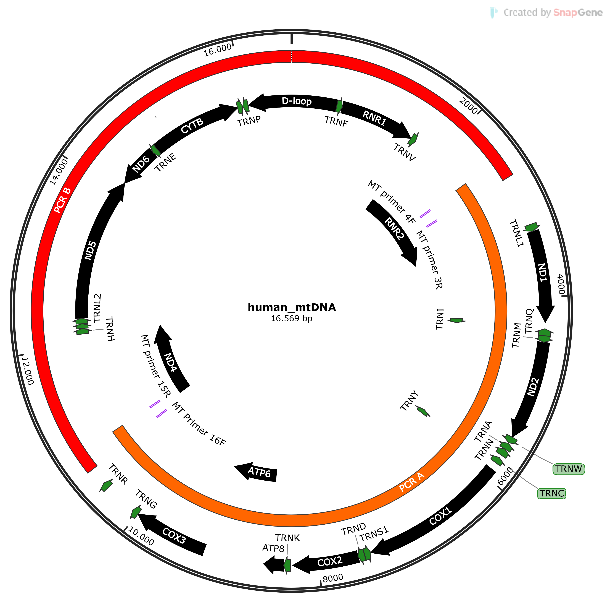

# Genepi Molmed Hackathon
Welcome to the Genepi MinION Hackathon! 
Your task today is to analyse mtDNA data generated from Oxford Nanopore. The data has been generated using a transposase library prep kit on a mixture of two long-rage PCR amplicons, which each amplify about half of the mtDNA genome. The amplicons overlap by about 200 at each end. 
Mind that a transposase library prep on so short amplicons (about 8.5 kb each) produces rather short reads. These are rather untypical for nanopore sequencing at genome scale or when using a ligation library prep kit, which would specifically ligate the adaptors to the end of the amplicons and thus produce full-length amplicon reads.

## Setup
* Every time you read something like `<surename>` or `<q-number>` this is just a place holder. Replace it with the actual name! 
* Create a Word Document (named: `SS24_NGS_Molmed_<Surname>.docxà) and document what you do (e.g. commands, screenshots, graphics). This file must be sent at the end of the class to Sebastian. 
* Create a folder `project-day` within  `genepi-teaching/students/<your-q-number>`. 
* Copy one of the barcode folders (`cp -r <barcode04> .`) to your `project-day` folder. The files are located here: `~/genepi-teaching/ngs/2024-ngs-molmed`. The structure should look like this at the end.

## Structure
```
└── project-day
    └── barcode04
        ├── file1.fastq.gz
        └── file.fastq.gz
        └── ...
```
## Quality Control

The first step of our analysis is to run a QC analysis on our data. For Nanopore data, we use a tool called [Nanoplot](https://github.com/wdecoster/NanoPlot?tab=readme-ov-file#usage). The usage looks complicated but at the end, you only need some options. 
```
NanoPlot --fastq_rich <your-fastq-files> -o <output-directory>
``` 
**HINT**: Use `*fastq.gz` for `<your-fastq-files>` if you have several files!

This tool outputs a HTML report, look for the report, download it to your local filesystem and see what information you can identify. Add some plots to your Word file!

## Mapping

Now it's time to align our data using a tool called `minimap2`. Replace <your-fastq-file> with your input-file (included in your barcode folder) and <yourbarcode> with the name of your actual barcode. The reference can be found here: `~/genepi-teaching/students/reference-data/chrM.fasta`

```
minimap2 -ax map-ont <reference> <your-fastq-files> | samtools sort > <yourbarcode>.bam
```
**HINT**: Use `*fastq.gz` for `<your-fastq-files>` if you have several files!

## Visualize Mapping
Run samtools depth on your BAM file and visualize the result.txt file with Excel.
```
samtools depth -a <yourbamfile> > result.txt
```
      
### Variant Calling
Run Variant Calling with a tool created for mtDNA data.
```
/opt/tools/mutserve/mutserve call <your-bam.bam> --reference <reference> --level 0.1 --output <output-name>.vcf.gz
```

Congratulations you have now run your first variant calling!!

### Haplogroups
mtDNA profiles can also be grouped into so called [haplogroups](https://en.wikipedia.org/wiki/Human_mitochondrial_DNA_haplogroup). 
- Download the file to your local workstation and upload the VCF File to https://haplogrep.i-med.ac.at
- Interpret the results (use the Haplogrep docs) and add information to your Word file.  

### PCR Products
