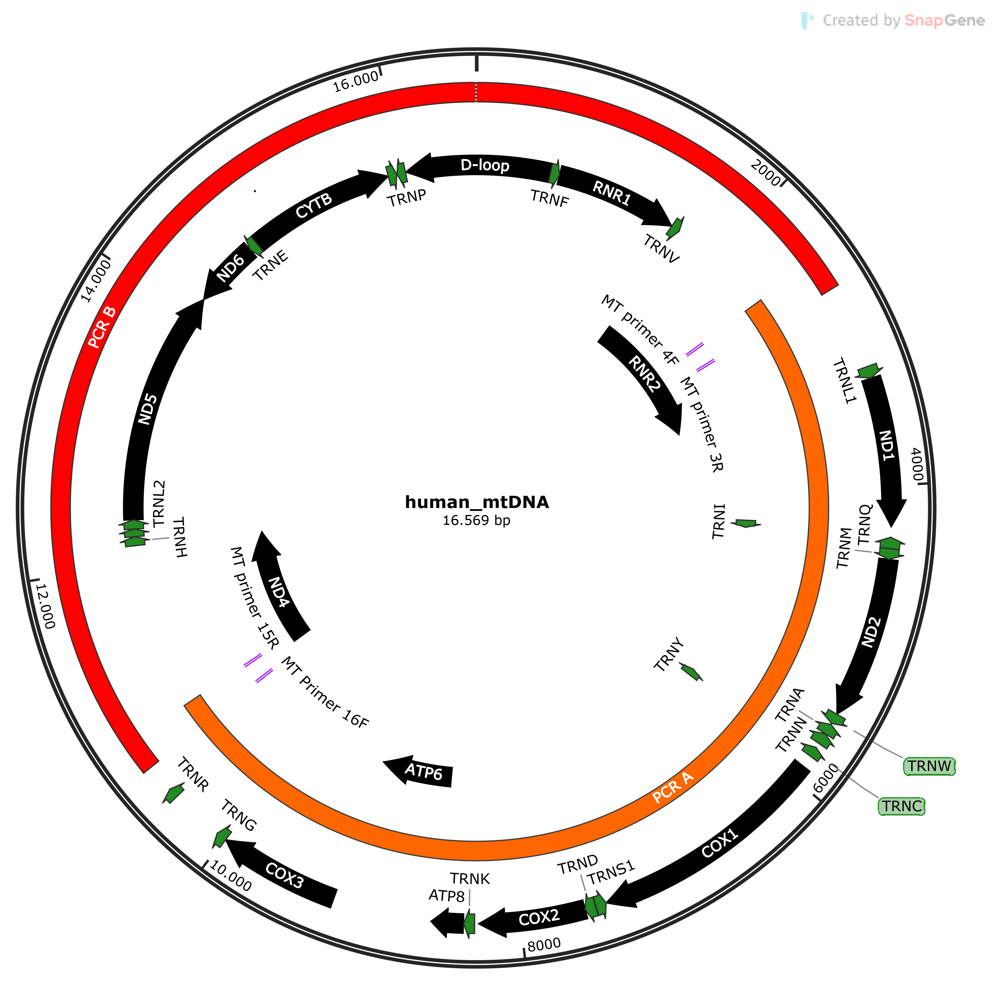

## Genepi Hackathon
Welcome to the Genepi MinION Hackathon! 
Your task today is to analyse mtDNA data generated from Oxford Nanopore. The data has been generated using a transposase library prep kit on a mixture of two long-rage PCR amplicons, which each amplify about half of the mtDNA genome. The amplicons overlap by about 200 at each end. 
Mind that a transposase library prep on so short amplicons (about 8.5 kb each) produces rather short reads. These are rather untypical for nanopore sequencing at genome scale or when using a ligation library prep kit, which would specifically ligate the adaptors to the end of the amplicons and thus produce full-length amplicon reads.
Sequencing chemistry was R9 (older chemistry version), which has a higher error rate than the latest V14 chemistry.

## Setup
* Create a Word Document (named: SS23_NGS_PHD_Surname.docx) and document what you do (e.g. commands, screenshots, graphics). This file must be sent to us at the end of the class to Sebastian/Stefan via Mail.
* Create a folder `project-day` within  `genepi-teaching/students/<your-q-number>`. 
* Copy one of the barcode folders (barcode 03 - barcode 12, `cp -r <folder> .`) to your `project-day`  folder. The files are located here: `~/genepi-teaching/ngs-bioinformatics/2023-ngs-phd`. The structure should look like this at the end.

### Structure
```
└── project-day
    └── barcode04
        ├── 1.fastq.gz
        └── 2.fastq.gz
```
## Run QC
Unlike to NGS data, here we are using a different QC tool. The tool is called [NanoPlot](https://github.com/wdecoster/NanoPlot) and is already installed at the cluster. Go to the GitHub site, read the documentation and execute NanoPlot on your data. Look through the options and assemble what you like most. Explore the outputs, copy them to Windows and put the command as well as read statistics and the most useful graphs to your local Word file. 

### Run Mapping/Alignment
For mapping and alignment we are using [minimap2](https://github.com/lh3/minimap2). The tool is also already installed, execute it on the raw FASTQ data (without applying any QC-trimming etc.). Convert the resulting `sam file` to a `bam file` and index it. The reference can be found here: `~/genepi-teaching/students/reference-data/chrM.fasta`

## Visualize Mapping
Run samtools depth on your BAM file (add the -a option; what is this option doing and why do we want to add it) and visualize the per-base coverage with Excel or RStudio. Are there any peculiarities?  Have a look at the file with Tablet
      
### Variant Calling
Run Variant Calling with a tool created fot mtDNA data.
To run the tool enter the following command: `/opt/tools/mutserve/mutserve call` and add the required parameters. (Specify reference, level output and input). As a `level` use a level `0.1`). 

### Filter VCF
Use bcftools to extract the chromosome, position and coverage column (DP) from the VCF file.  

### Haplogroups
mtDNA profiles can also be grouped into so called [haplogroups](https://en.wikipedia.org/wiki/Human_mitochondrial_DNA_haplogroup). 
- Upload the VCF File to https://haplogrep.i-med.ac.at
- Interpret the results (use the Haplogrep docs) and add information to your Word file.  

## Scripting
Copy a second barcode folder to your `project-day` folder. Write a bash script including `mapping`, `samtools depth` and `variant calling` that iterates over all files.

### Structure
```
└── project-day
    ├── barcode04
    │   ├── 1.fastq.gz
    │   └── 2.fastq.gz
    └── barcode08
        ├── 1.fastq.gz
        └── 2.fastq.gz
```


### PCR Products

